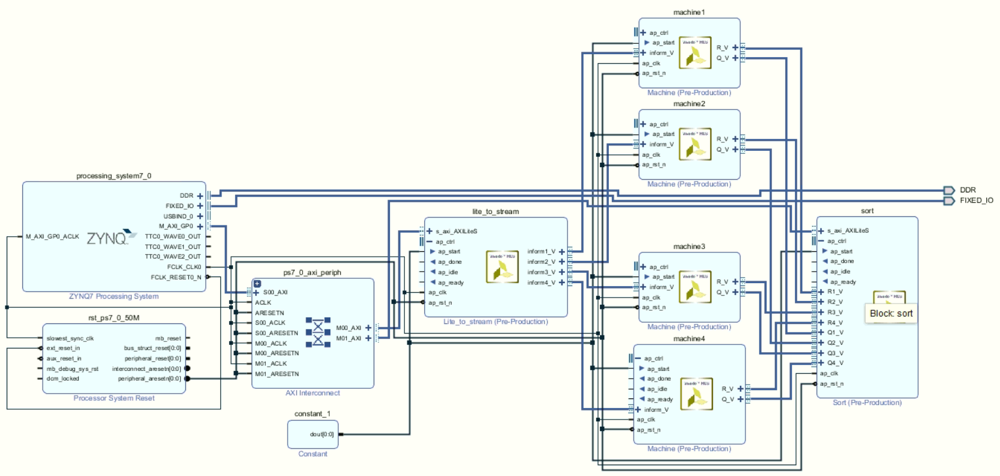
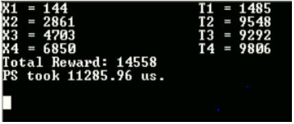

## Description

--> This repository contains all the source codes for the Zynq implementation of the multi-armed bandit (MAB) arm-learning algorithm.

--> This implementation is for four arms with a minimum subset size of two, that is, N = 4 and K = 2.

--> The .cpp files are the main files and the testbench files that have been used for generating the HLS IPs usign Vivado HLS.

--> The variables used in the Vivado HLS codes are of 32-bit standard-precision floating-point (SP-FL) type.

--> The "helloworld_sdk" file is the C code used to generate the baremetal application in Vivado SDK (Software Development Kit).

--> The "helloworld_arm" file is the C code for implementing the entire algorithm in the ARM processor itself using Vivado SDK.

## Block Diagram

## Terminal Output Snapshot

